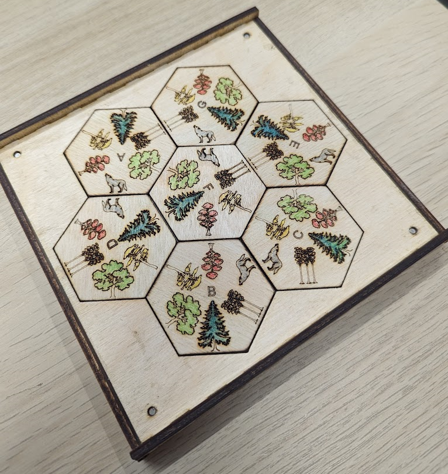

# Tree Matching

Given this puzzle, find a solution. The hexagons must be places in the holder, and each edge that touches must display the same image. Shown below is the solution.



This repository uses Python and recursion to find a solution programmatically.

For solution, see [`matcher.py`](./matcher.py). Currently, it finds "6 solutions", which are actually 1 solution, with 6-times rotational symmetry.

## Commands

### Test

```bash
pip install pytest
pytest
```

### Find solution

```bash
py matcher.py
```

### Example output

```text
Solution 1:

    B
C       D
    F
E       A
    G


           c
        f     b
   f    a     e    b
c     a    d    e     f
d     e    d    c     d
   b    e     c    a
   b    f     b    a
a     f    a    b     d
d     c    a    f     e
   e    c     f    c
        b     e
           d
```
